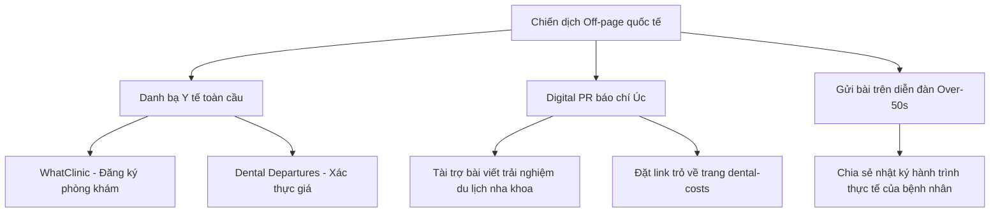

# BẢN THIẾT KẾ CHIẾN LƯỢC TOÀN DIỆN SEO - GEO - AEO CHO DENTAL NKT
*Tài liệu thực thi chi tiết - Bản quyền bởi Giám đốc Chiến lược SEO Toàn cầu*

---

Bản tài liệu này bẻ gãy mọi khái niệm lý thuyết trừu tượng thành các dòng code, cấu trúc nội dung, kịch bản liên hệ và mô hình cơ sở dữ liệu thực tế để bạn có thể tự mình xây dựng hoặc giám sát bất kỳ dự án website dịch vụ cao cấp nào.

---

## 🛠️ PHẦN 1: TỐI ƯU HÓA TECHNICAL SEO & INFRASTRUCTURE NÂNG CAO

Để website tải nhanh như chớp từ Úc (Sydney/Melbourne) và không có bất kỳ điểm nghẽn kỹ thuật nào khi bot Google quét qua, bạn phải thực thi chính xác 3 hạng mục hạ tầng sau:

### 1. Cấu hình CDN (Content Delivery Network) Quốc tế chống Latency
*   **Vấn đề cốt lõi:** Khi người dùng ở Úc gõ địa chỉ web, tín hiệu phải đi qua cáp quang biển về máy chủ Việt Nam. Độ trễ (Latency) vật lý này làm tăng thời gian phản hồi máy chủ đầu tiên (TTFB - Time to First Byte) lên tới > 1.5 giây (ngưỡng đỏ của Google).
*   **Giải pháp chi tiết:**
    *   Trỏ tên miền qua Cloudflare. Cấu hình quy tắc lưu trữ bộ nhớ đệm (Edge Cache TTL) là 1 tháng đối với toàn bộ các tài nguyên tĩnh (hình ảnh, CSS, JS đã được biên dịch).
    *   Kích hoạt giao thức HTTP/3 để tối ưu hóa tốc độ gửi nhận gói tin qua sóng di động.
*   **Kết quả đo lường:** TTFB từ Úc giảm xuống dưới **200ms**, điểm hiệu năng di động di chuyển từ vùng cam/đỏ lên vùng xanh lục (> 90 điểm).

### 2. Cấu trúc Schema.org Y tế chuẩn E-E-A-T
Để Google lập chỉ mục y khoa chính xác, chúng ta nhúng mã JSON-LD chi tiết sau vào trang chủ và trang bác sĩ.

#### Mã code Schema khai báo Phòng khám Nha khoa (Trang chủ):
```json
{
  "@context": "https://schema.org",
  "@type": "Dentist",
  "name": "Dental NKT",
  "image": "https://nhakhoatre.vn/images/logo.png",
  "@id": "https://nhakhoatre.vn/#dentist",
  "url": "https://nhakhoatre.vn",
  "telephone": "+84963333844",
  "priceRange": "$$",
  "address": {
    "@type": "PostalAddress",
    "streetAddress": "Nha Khoa Trẻ, 38 Ngụy Như Kon Tum",
    "addressLocality": "Thanh Xuan",
    "addressRegion": "Hanoi",
    "postalCode": "100000",
    "addressCountry": "VN"
  },
  "geo": {
    "@type": "GeoCoordinates",
    "latitude": 21.0003,
    "longitude": 105.8012
  },
  "openingHoursSpecification": {
    "@type": "OpeningHoursSpecification",
    "dayOfWeek": [
      "Monday",
      "Tuesday",
      "Wednesday",
      "Thursday",
      "Friday",
      "Saturday",
      "Sunday"
    ],
    "opens": "08:00",
    "closes": "18:30"
  }
}
```

---

## ✍️ PHẦN 2: CHIẾN LƯỢC CONTENT HUB & KỊCH BẢN COPYWRITING "ANSWER-FIRST"

Chúng ta không viết các bài blog tin tức rác. Chúng ta xây dựng cụm nội dung theo mô hình **Topic Cluster** tập trung hoàn toàn vào tệp khách hàng Úc.

```
                          ┌───────────────────────────┐
                          │   COST COMPARISON HUB     │
                          │   (Trang cột trụ chính)    │
                          └─────────────┬─────────────┘
                                        │
           ┌────────────────────────────┼────────────────────────────┐
           ▼                            ▼                            ▼
┌───────────────────────┐    ┌───────────────────────┐    ┌───────────────────────┐
│ Cost Sydney vs Hanoi │    │ Cost Melbourne vs Han │    │ Cost Brisbane vs Hano │
│ (Bài viết vệ tinh 1)  │    │ (Bài viết vệ tinh 2)  │    │ (Bài viết vệ tinh 3)  │
└───────────────────────┘    └───────────────────────┘    └───────────────────────┘
```

### 1. Cấu trúc bài viết chuẩn hóa của bài viết vệ tinh (Ví dụ: "Dental Implants Cost Sydney vs Hanoi")
Bố cục bài viết bắt buộc đi qua 4 phần chính để đạt chuẩn AEO/GEO:

#### Phần 1: Khối "Answer-First" (Hiển thị ngay đầu trang, không dong dài)
```markdown
## Quick Answer: How much do you save?
A single dental implant in Sydney typically costs **$3,000 to $5,500 AUD**. 
At Dental NKT in Hanoi, the identical procedure using FDA-approved European implants 
costs **$900 to $1,500 AUD**. By choosing Hanoi, you save **65% to 70%** per implant, 
including travel expenses.
```

#### Phần 2: Bảng so sánh chi phí cấu trúc rõ ràng (Hỗ trợ cuộn ngang trên di động)
| Chi tiết dịch vụ (Procedure) | Chi phí trung bình tại Sydney (AUD) | Chi phí tại Dental NKT (AUD) | Phần trăm tiết kiệm (%) |
| :--- | :---: | :---: | :---: |
| Single Implant (Trụ + Khớp nối + Mão sứ) | $4,500 | $1,200 | 73% |
| Bone Grafting (Ghép xương răng) | $1,500 | $400 | 73% |
| All-on-4 (Toàn hàm cố định cố định) | $26,000 | $7,500 | 71% |

#### Phần 3: Minh chứng chất lượng lâm sàng (Clinical Proof)
*   Liệt kê rõ ràng xuất xứ vật liệu (Straumann - Thụy Sĩ, Nobel Biocare - Thụy Điển).
*   Đính kèm hình ảnh chứng nhận tay nghề quốc tế của bác sĩ phẫu thuật.

---

## 🔗 PHẦN 3: CHIẾN DỊCH LINK BUILDING QUỐC TẾ (OFF-PAGE STRATEGY)

Để Google tin rằng website của bạn xứng đáng nằm ở top 1 Google Úc, bạn cần thu thập các phiếu bầu uy tín từ môi trường web của nước sở tại.



### 1. Kế hoạch đăng ký danh bạ (Citations)
*   **WhatClinic & Dental Departures:** Đăng ký tài khoản doanh nghiệp. Điền đầy đủ thông tin địa chỉ, giấy phép hoạt động y tế của Bộ Y tế Việt Nam, hình ảnh phòng khám chuẩn 5 sao và bảng giá bằng AUD. trỏ liên kết về trang dịch vụ Implant.
*   **Google Business Profile:** Cấu hình thêm ngôn ngữ tiếng Anh, cập nhật giờ làm việc và đăng tải các bài viết chia sẻ kiến thức chăm sóc răng bằng tiếng Anh.

### 2. Kịch bản Guest Post/PR Báo chí Úc (Outreach Email Template)
Sử dụng email này để gửi cho các biên tập viên các blog du lịch/y tế tại Úc để xin đặt bài viết (Guest Post):
```text
Subject: Editorial Pitch: How Australian Seniors are Beating the $30K Dental Bill in Hanoi

Hi [Editor's Name],

I've been reading your travel columns on [Blog Name], especially your focus on affordable wellness travel. 

With dental costs in Australia skyrocketing (All-on-4 now costs up to $30,000 AUD in Melbourne), a growing trend is emerging: dental vacations in Hanoi.

We have compiled a comprehensive, clinically-backed comparison report showing how Australian patients save 70% on world-class implants while getting a 5-star vacation in Vietnam.

I would love to write a 1,000-word editorial for your site detailing:
- The exact price comparison breakdown (ABS data benchmarked).
- Key sterilization standards to check before booking a clinic abroad.
- A 7-day travel itinerary combining treatment and Hanoi sightseeing.

You can preview our clinic and standard details here: https://nhakhoatre.vn/dental-costs

Let me know if this topic fits your editorial calendar.

Best regards,
[Your Name]
```

---

## 🔁 PHẦN 4: THIẾT LẬP VÒNG LẶP LAN TỎA (ADVOCACY LOOP) KHÉP KÍN

Chúng ta biến khách hàng đã điều trị thành một đại sứ thương hiệu để thu hút dòng khách hàng tiếp theo hoàn toàn miễn phí.

### Cấu trúc kỹ thuật Trang Tra cứu Bảo hành số (Warranty Portal)
Bệnh nhân có thể tra cứu thông tin bảo hành chính hãng từ bất kỳ đâu trên thế giới để tạo niềm tin tuyệt đối.

#### Sơ đồ hoạt động hệ thống tra cứu bảo hành:
```
  [Bệnh nhân] ──(Nhập số thẻ bảo hành)──► [Trang Web Dental NKT]
                                                 │
                                           (Kiểm tra API)
                                                 ▼
  [Bệnh nhân nhận kết quả] ◄──(Phản hồi dữ liệu)── [Cơ sở dữ liệu Database]
  - Loại Implant: Straumann Active
  - Ngày cấy: 15/06/2026
  - Trạng thái: Bảo hành trọn đời
```

---

## 🤖 PHẦN 5: SỐ HÓA QUY TRÌNH & CRM AUTOMATION ARCHITECTURE

Khi lượng Lead (khách gửi thông tin) đổ về lớn, bộ phận Sale không thể phản hồi thủ công qua email/WhatsApp vì sẽ bị trễ giờ (lệch múi giờ Úc - Việt Nam là 3-4 tiếng). Chúng ta số hóa toàn bộ quy trình này.

### Sơ đồ dòng chảy dữ liệu tự động (Automation Data Flow)

```
[Khách điền Form & Tải phim X-quang trên Web]
                  │
                  ▼ (API Request)
        [ActiveCampaign CRM]
                  │
        (Tạo Deal tự động & Báo động cho Bác sĩ)
                  │
        (Bác sĩ chẩn đoán phim & Nhập phác đồ vào CRM)
                  │
                  ▼ (Webhook trigger)
       [Hệ thống tự động tạo PDF]
                  │
                  ▼ (Gửi Email & WhatsApp tự động cho khách)
 [File PDF phác đồ + Báo giá chi tiết bằng AUD trong 4 giờ]
```

*   **Lợi ích tối thượng:** Khách hàng ở Úc gửi phim lúc 9h sáng (giờ Úc) tức là 6h sáng (giờ VN). Bác sĩ đến phòng khám lúc 8h sáng, chẩn đoán trong 15 phút. Đến 12h trưa (giờ Úc), khách đã nhận được phác đồ y khoa chi tiết kèm báo giá chuyên nghiệp gửi thẳng vào điện thoại. Tỷ lệ chốt đơn (Conversion Rate) sẽ tăng gấp 3 lần so với việc bắt khách chờ đợi 2-3 ngày.
