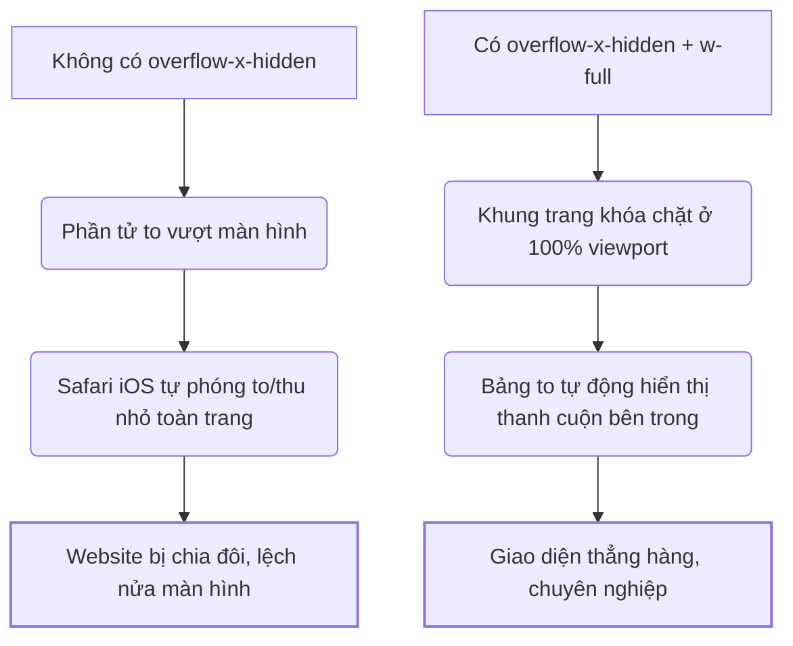

# GIẢI THÍCH CHI TIẾT TẬN GỐC GIAI ĐOẠN 1: SEO KỸ THUẬT & CONTENT NỀN TẢNG
*Giáo trình thực chiến dành cho người mới bắt đầu học làm web.*

---

Trong giai đoạn đầu tiên (xây móng), chúng ta thực hiện 5 kỹ thuật cốt lõi. Dưới đây là phân tích chi tiết tận gốc từng kỹ thuật theo mô hình tư duy phản biện:

---

## 1. KHÓA VIEWPORT DI ĐỘNG CHỐNG TRÀN LỀ (`overflow-x-hidden` & `w-full`)

*   **Nó là gì?** 
    *   `w-full` là lệnh CSS bắt buộc chiều rộng của khung trang bằng đúng 100% chiều rộng màn hình thiết bị (điện thoại).
    *   `overflow-x-hidden` là lệnh khóa trục ngang (trục X), không cho phép bất kỳ nội dung nào bị lồi ra ngoài lề màn hình. Nếu có phần tử nào cố tình lồi ra, nó sẽ bị cắt bỏ (ẩn đi) thay vì kéo dãn trang web ra.
*   **Vai trò của nó:** Giữ cho toàn bộ trang web luôn nằm gọn gàng trong màn hình điện thoại của người dùng, bất kể màn hình to hay nhỏ.
*   **Tác động ảnh hưởng thế nào:** Giúp giao diện trang web trông chuyên nghiệp, cân đối ở cả lề trái và lề phải.
*   **Nó liên kết với cái gì:** Liên kết chặt chẽ với các thành phần có chiều rộng lớn như bảng giá (`table`), hình ảnh lớn, hoặc các hiệu ứng chuyển động trượt ngang.
*   **Không có nó thì sao?** 
    *   Trang web sẽ bị lỗi "Tràn khung ngang" (như ảnh lỗi bạn đã chụp). Người dùng sẽ thấy website bị lệch hẳn sang một bên, xuất hiện khoảng trống trắng lớn ở bên phải và các nút bấm bị cắt cụt không thể chạm vào được.

---

## 2. KHAI BÁO THẺ ĐỊNH DANH CANONICAL (`alternates.canonical`)
*   **Nó là gì?** Là một dòng mã HTML nằm ẩn trong phần đầu trang `<head>` nhằm khai báo với Google: *"Đây là địa chỉ URL gốc, chính thức và duy nhất của bài viết này"*.
*   **Vai trò của nó:** Định danh và xác thực bản quyền nội dung.
*   **Tác động ảnh hưởng thế nào:** Giúp Google biết trang nào là trang gốc để tập trung xếp hạng cho trang đó, không phân tán sức mạnh.
*   **Nó liên kết với cái gì:** Liên kết trực tiếp với thuật toán tìm kiếm của Google (Google Search Index) và cấu trúc liên kết (URL) của website.
*   **Không có nó thì sao?** 
    *   Nếu trang web của bạn có nhiều đường dẫn cùng trỏ về một nội dung (Ví dụ: `nhakhoatre.vn/`, `nhakhoatre.vn/index.html`, hoặc đường dẫn có chứa mã theo dõi quảng cáo `nhakhoatre.vn/?utm_source=facebook`), Google sẽ phạt lỗi **Trùng lặp nội dung (Duplicate Content)**. Website sẽ bị tụt hạng thê thảm vì Google không biết nên hiển thị trang nào trên kết quả tìm kiếm.

---

## 3. ĐỒNG BỘ THẺ OPEN GRAPH (OG Meta Tags)
*   **Nó là gì?** Là các thẻ mã hóa (như `og:title`, `og:description`, `og:image`) giúp các mạng xã hội (Facebook, Zalo, LinkedIn, iMessage) đọc hiểu và hiển thị tóm tắt trang web dưới dạng một chiếc thẻ thông tin đẹp mắt (Card).
*   **Vai trò của nó:** Làm đại diện hình ảnh và nội dung cho website khi được chia sẻ ra bên ngoài.
*   **Tác động ảnh hưởng thế nào:** Tăng tỷ lệ người dùng click vào link khi thấy link chia sẻ trên mạng xã hội nhờ ảnh xem trước (thumbnail) sắc nét và tiêu đề hấp dẫn.
*   **Nó liên kết với cái gì:** Liên kết với hệ thống hiển thị (crawler) của các nền tảng mạng xã hội và ứng dụng chat nhắn tin.
*   **Không có nó thì sao?** 
    *   Khi bạn hoặc khách hàng gửi link website qua Zalo hay Facebook, link sẽ chỉ hiện một dòng chữ thô sơ màu xanh, không có hình ảnh minh họa, không có mô tả phòng khám. Người nhận sẽ cảm thấy link thiếu độ tin cậy (trông như link lừa đảo/spam) và sẽ không bấm vào xem.

---

## 4. CƠ CHẾ DOM MỞ CHO FAQ (FAQ DOM Visibility)
*   **Nó là gì?** DOM (Document Object Model) là toàn bộ cây cấu trúc chữ và mã nguồn của trang web mà trình duyệt vẽ ra. "DOM mở" nghĩa là toàn bộ câu hỏi và câu trả lời của mục FAQ luôn tồn tại sẵn trong mã nguồn, chỉ được ẩn đi bằng CSS (`display: none` hoặc `hidden`) chứ không bị xóa khỏi code.
*   **Vai trò của nó:** Giúp robot cào dữ liệu của Google đọc được toàn bộ các câu trả lời FAQ ngay lập tức mà không cần phải thực hiện hành động bấm click mở tab.
*   **Tác động ảnh hưởng thế nào:** Google sẽ hiểu website của bạn có nhiều kiến thức y khoa giá trị, từ đó dễ dàng kéo website lên top đầu và hiển thị các câu hỏi FAQ trực tiếp trên trang tìm kiếm (Rich Snippets).
*   **Nó liên kết với cái gì:** Liên kết trực tiếp với robot tìm kiếm của Google (Googlebot) và các mô hình trí tuệ nhân tạo (AI Search) chuyên đi cào dữ liệu để trả lời người dùng.
*   **Không có nó thì sao?** 
    *   Nếu bạn dùng React để ẩn nội dung FAQ theo kiểu: *"chỉ khi nào người dùng bấm click mới render chữ ra màn hình"*, Googlebot khi quét qua trang web sẽ thấy mục FAQ hoàn toàn trống rỗng (vì bot không biết tự bấm click). Toàn bộ công sức viết câu hỏi và trả lời FAQ của bạn sẽ trở thành vô nghĩa đối với SEO.

---

## 5. CONTENT CHI TIẾT & TỐI ƯU ANSWER-FIRST (Cost Comparison Content)
*   **Nó là gì?** 
    *   **Content chi tiết:** Bài viết đi thẳng vào số liệu thực tế, giải quyết đúng nỗi lo của khách hàng.
    *   **Answer-First:** Đưa ngay câu trả lời cốt lõi (Ví dụ: giá tiền bao nhiêu, làm mất bao nhiêu ngày) lên 50-100 từ đầu tiên của trang web, thay vì bắt người đọc phải cuộn xuống tận cuối trang mới thấy.
*   **Vai trò của nó:** Giải quyết nhanh nhu cầu thông tin của người dùng và các công cụ tìm kiếm AI thế hệ mới (AEO).
*   **Tác động ảnh hưởng thế nào:** Giúp giảm tỷ lệ thoát trang (Bounce Rate) vì người dùng tìm thấy câu trả lời ngay lập tức. Ngoài ra, giúp bài viết dễ được các mô hình AI (như ChatGPT, Gemini) trích xuất làm câu trả lời cho người dùng.
*   **Nó liên kết với cái gì:** Liên kết với hành vi đọc lướt (scanning) của người dùng thời đại số và thuật toán xếp hạng AI Search (SGE/AEO).
*   **Không có nó thì sao?** 
    *   Nếu bài viết viết theo kiểu văn xuôi dài dòng, bắt khách hàng đọc hàng nghìn chữ giới thiệu lịch sử phòng khám mới thấy bảng giá: Khách hàng di động sẽ mất kiên nhẫn, thoát trang ngay lập tức (làm tụt điểm chất lượng của web). Google và các AI Search cũng không thể trích xuất được câu trả lời ngắn gọn để xếp hạng bạn lên đầu.
